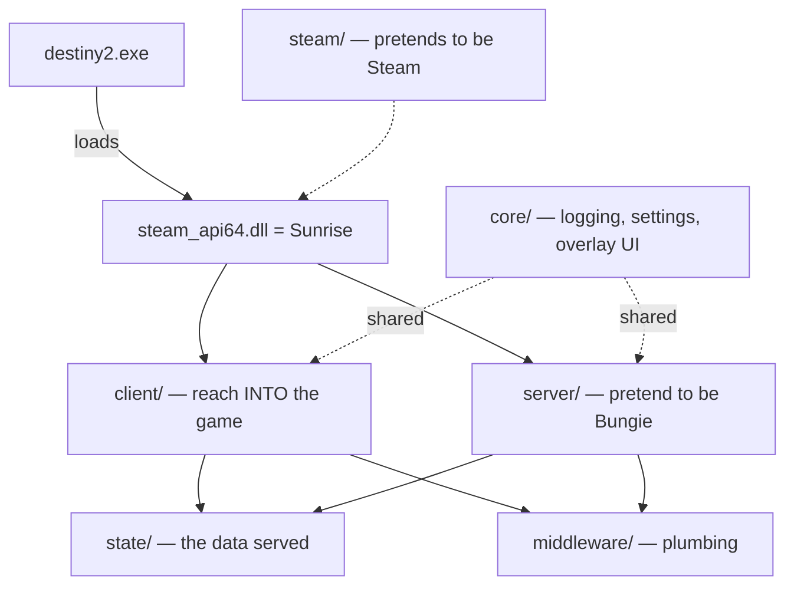

# Getting Started with Sunrise Development

A first-day guide for someone new to this codebase.

## 1. What Sunrise is

`destiny2.exe` is the real game. Sunrise compiles to `steam_api64.dll`, which the game loads at
startup; it answers the game's requests locally so the game runs offline, with no Bungie
connection.

- **It's not Bungie's code.** Every file was written by the Sunrise team by studying how the
  game behaves and re-creating the server's responses.
- **The content is already on disk.** Music, models, and maps ship in the game's `.pkg` files.
  Sunrise re-creates the *systems that trigger* content — "add music" means re-creating the
  trigger, not importing an mp3.

## 2. Setup

| Tool | Version | Why |
|---|---|---|
| Visual Studio | 2026 (v18), Desktop C++ workload | Compiler + debugger |
| Windows SDK | 10.0.26100 (exact) | The build pins it |
| Git | recent | Clone the repo |
| Destiny 2 files | ~100 GB via DepotDownloader | The client the DLL loads into |

**The one build gotcha:** a stock build dies on `physics_state_runtime.cpp` with
`error C1060: compiler is out of heap space`, even with plenty of RAM — the 32-bit compiler host
is capped at ~4 GB. Fix: force the 64-bit host. Add a `Directory.Build.props` at the repo root:

```xml
<Project>
  <PropertyGroup>
    <PreferredToolArchitecture>x64</PreferredToolArchitecture>
  </PropertyGroup>
</Project>
```

…or pass `/p:PreferredToolArchitecture=x64` on every build.

**Two one-time clicks in Visual Studio** (it remembers them):
1. Toolbar dropdown → **Release | x64**.
2. Tools → Options → Text Editor → C/C++ → Code Style → Formatting → enable **ClangFormat**.

## 3. The map

Everything is under `src/`, split six ways. The split is "reach into the game" vs. "pretend to
be the server."



| Folder | Meaning | Go here to… |
|---|---|---|
| `client/` | Reach into the game — hooks, memory, player, overlay | Add most features |
| `server/` | Emulate Bungie's servers | Emulate a backend system |
| `state/` | The data the fake server has | Change accounts, inventory, activities |
| `middleware/` | Plumbing: crypto, compression, content readers | Rarely, early on |
| `core/` | Shared: logging, settings, the overlay UI | Add UI panels, read settings |
| `steam/` | Masquerade as Steam | Almost never |

`src/dllmain.cpp` runs first when the game loads the DLL.

**Navigation in Visual Studio:** **Ctrl+,** to open a file by name, **F12** to jump to a
definition, **Shift+F12** to find all uses. Following F12 through the code teaches the structure
faster than browsing folders.

## 4. The dev loop

1. **Edit** a `.cpp`/`.h`.
2. **Build** — Ctrl+Shift+B (Release|x64, with the x64-host fix).
3. **Deploy** — copy the built `steam_api64.dll` into the game folder via `deploy-mybuild.ps1`
   (game must be closed; the DLL is locked while running).
4. **Launch** `destiny2.exe` directly (not through Steam).
5. **See it** — press **INSERT** for Sunrise's overlay.
6. **Debug** — VS → Debug → Attach to Process → `destiny2.exe`. The `.pdb` the deploy step
   copies is what makes breakpoints work.

Keep vanilla and official-release copies of the DLL for rollback.

### Helper scripts (`scripts/`)

Optional convenience scripts. Everything they do can be run by hand (see the Quick Reference) —
they just save the typing. See [`scripts/README.md`](../scripts/README.md) for full usage.

- **`SunriseInstall.ps1`** — one-shot first-time setup. Checks the toolchain (Git, MSBuild/VS,
  SDK) and installs what's missing (Git auto via winget; VS is offered, not forced), adds
  Defender exclusions, downloads the game via DepotDownloader, installs the official release DLL
  as a baseline, clones the repo, and builds once. Re-runnable — finished steps are skipped. It
  also writes `deploy-mybuild.ps1`. Run elevated.

- **`Sunrise-DevLoop.ps1`** — the daily driver. One command: build → deploy → launch → attach
  the VS debugger. First run asks for your game folder once and remembers it; the repo is
  auto-detected from the script's location. Flags: `-BuildOnly`, `-NoAttach`, `-Config Debug`
  (better for breakpoints), `-OpenIDE`, and `-Rollback official|vanilla` to swap the live DLL
  back to a baseline. Auto-detects MSBuild via `vswhere`.

- **`deploy-mybuild.ps1`** — just the deploy step: copies your built DLL + PDB into the game
  folder (refuses if the game is running). Generated by the installer.

- **`gen_glossary.py`** — regenerates a module glossary from the code's own doc-comments.
  `python gen_glossary.py src` → `Sunrise-Glossary.html` + `.md`.

## 5. Your first change

Prove the loop before writing a feature:

1. **Ctrl+,** → `ui_hud_status_overlay.cpp` (in `core/ui/hud/overlays/`).
2. In `draw()`, add: `ImGui::TextDisabled("your name was here");`
3. Build → deploy → launch → INSERT. Your text shows in the status overlay.
4. Delete it. You've now proven the loop works on your machine.

## 6. Match the house style

Read **[coding-style.md](coding-style.md)** before writing real code. The headlines:
doc-comment every function, struct, and constant; **no magic numbers** (name every constant
`constexpr` with a comment on its source); `noexcept` and `[[nodiscard]]` almost everywhere;
return a named outcome enum instead of a bare `bool` when something can fail in more than one
way; comments explain *why*. Formatting is handled by `.clang-format` — keep format-on-save on.

Reverse-engineering findings get their own doc under `Sunrise/docs/`; `emote-unlocks.md` is the
model.

## 7. Where to go next

Read a merged or open PR end to end first — each feature is a new `client/hooks/<name>/` folder
that finds a game function by byte-signature and hooks it. The photo-mode and emote-wheel PRs
are good examples.

Open first features, easiest first:

- **Free Cam** — `client/hooks/fly/fly.h` already drives player velocity through the physics
  step; free cam is the same trick on the camera.
- **Dev console** — `core/ui/modules/logs/` renders a scrolling filterable panel; a console is
  that plus a text input and a command table.
- **Settings → state** — routing one client-only setting through to server state teaches the
  settings system at low risk.

**Already shipped or in active PRs — check the PR list before starting anything:** entity
spawner, per-destination orbit, fly, noclip, infinite ammo, teleport distance, inventory /
ornaments / collections, emote wheel, photo-mode presentation, bubble names.

**Avoid as a beginner:** AI, Missions, bungiescript, Blua decompiler, Mod system — multi-month
pillars or blocked on scripting that doesn't exist yet.

## 8. Reality check

- Many features require finding a function or struct in `destiny2.exe` by byte-signature and
  hooking it (`client/patterns/` + `client/hooking/`). Start with features that reuse an
  existing hook.
- The Discord holds the tribal knowledge the repo doesn't. Ask if a feature is taken before
  building it.
- Read merged PRs — they show what "done" looks like in this codebase.

## 9. Quick reference

```
Build:   msbuild Sunrise.sln /m /p:Configuration=Release /p:Platform=x64 /p:PreferredToolArchitecture=x64
Deploy:  powershell -File deploy-mybuild.ps1   (game closed)
Run:     launch destiny2.exe directly, press INSERT
Debug:   VS → Debug → Attach to Process → destiny2.exe
Navigate: Ctrl+, = open file | F12 = definition | Shift+F12 = all uses
Rollback: copy steam_api64.dll.orig (vanilla) or .release (official) over the live DLL
```
