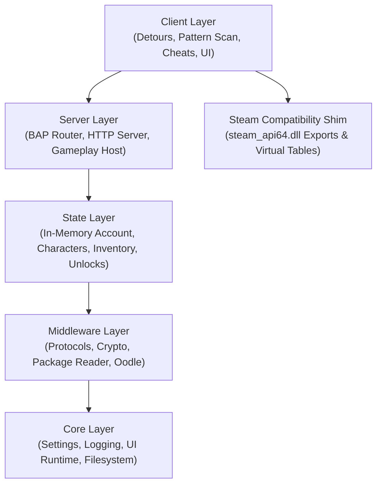

# Sunrise technical documentation

This directory explains the architecture and internal subsystems of Sunrise.

## System architecture overview

## Documentation index

- [Project structure and architecture](project-structure.md)
  Explains the layer layout, dependency boundaries, initialization and shutdown lifecycles, and configuration model.

- [Client integration and hooking](client-integration.md)
  Explains dynamic pattern scanning, Microsoft Detours integration, network redirection, and game engine hooks.

- [Network protocols](network-protocols.md)
  Documents SignOn HTTP authentication, the Binary Application Protocol (BAP), Web Service opcodes, and UDP gameplay transport.

- [Package and content system](package-and-content-system.md)
  Describes the Destiny 2 package (`.pkg`) archive structure, Oodle decompression, tag hashing, and runtime content extraction.

- [Server architecture](server-architecture.md)
  Details the local HTTP server, BAP transaction router, push notification staging, and physics world host.

- [State management](state-management.md)
  Covers the persistent in-memory data model, player characters, inventory buckets, subclass talent trees, and unlocks.

- [Steam compatibility shim](steam-shim.md)
  Details the replacement `steam_api64.dll`, exported functions, virtual method tables, and callback dispatch queue.

- [User interface and diagnostics](ui-and-diagnostics.md)
  Describes the embedded Dear ImGui overlay, HUD status widgets, real-time log viewer, and Wine/Proton compatibility.

- [Local gameplay and mission scope](local-gameplay-and-missions.md)
  Analyzes current destination loading capabilities and outlines requirements for campaign missions and enemy AI.

These technical notes describe the codebase implementation. For build instructions, see the repository [README](../README.md).
