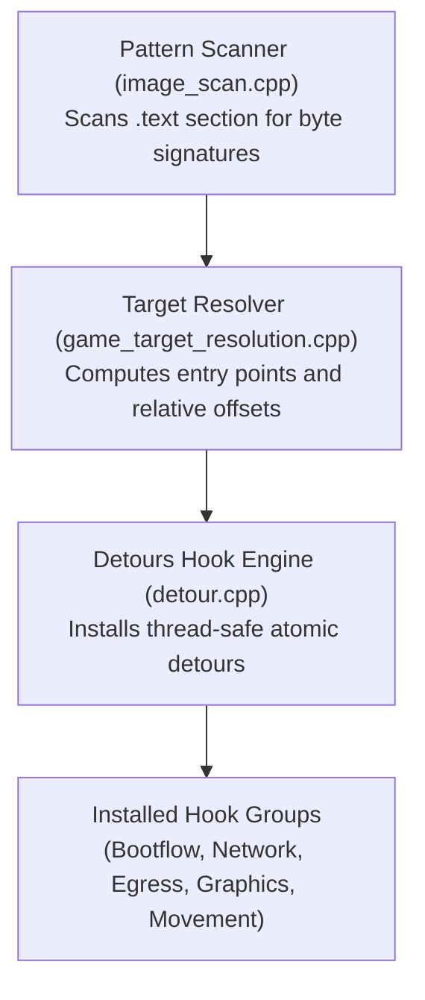

# Client integration and hooking

This document describes how Sunrise intercepts, scans, and modifies Destiny 2 client behavior in memory.

## Purpose

Sunrise does not only provide a custom local server. It also changes selected Destiny 2 client behavior inside the game process.

Sunrise builds as `steam_api64.dll`. The game loads this DLL in place of its expected Steam API library. The exported entry points are in [`Sunrise/src/dllmain.cpp`](../Sunrise/src/dllmain.cpp).

## Integration layers

Sunrise uses these layers together:

1. The Steam shim provides the Steam API entry points that the game calls.
2. The client runtime scans the main game image for known function signatures.
3. The hook runtime detours selected game and Steam functions.
4. The local server processes intercepted HTTP and BAP requests.
5. The client hooks change checks that reject the offline environment.

The client runtime resolves executable targets before it installs game hooks. A target signature must match the supported game build. If a required signature does not match, Sunrise stops client activation. See [`client_hook_activation.cpp`](../Sunrise/src/client/runtime/client_hook_activation.cpp).

---

## 1. Pattern scanning and target resolution

Sunrise dynamically locates game functions without hardcoded absolute memory addresses.

### Pattern registry (`patterns/registry.h`)

- **Signature definition**: Sequences of exact bytes and wildcard bytes (`PatternByte`).
- **Signature scanning (`image_scan.cpp`)**: Scans the mapped `.text` memory ranges of the game image.
- **Match validation**: Verifies that each required signature produces a unique match. If a signature matches zero times or multiple times, initialization stops.

### Target derivation

Some target addresses are not function entries. Sunrise calculates function pointers by following relative call offsets (`relative.h`) and RIP-relative memory operands from signature match sites.

---

## 2. Detour hooking engine

Sunrise wraps Microsoft Detours with transaction guards (`hooking/detour/`):

- **Atomic transactions**: Detours suspends worker threads before rewriting function entry points.
- **Safe uninstallation**: Before removing a hook, the engine verifies that no suspended thread has an instruction pointer inside the replacement code.
- **Trampolines**: The engine preserves original code paths through generated trampoline stubs.

---

## 3. Network and SignOn integration

The network hook group replaces these client paths:

- Network transport selection (redirects SDR transport to direct UDP sockets).
- HTTP request execution (intercepts REST queries for local routing).
- Bubble authority decoding (accepts local authority tokens).
- Untracked content lookup.
- SignOn readiness and failure handling.
- Steam networking authentication status and certificate handling.

The hook specifications are in [`network_hook_entries.cpp`](../Sunrise/src/client/hooks/network/lifecycle/network_hook_entries.cpp). The lifecycle code installs the game hook group with content and investment hooks as one unit. See [`network_hook_lifecycle.cpp`](../Sunrise/src/client/hooks/network/lifecycle/network_hook_lifecycle.cpp).

Sunrise can also point the client to a separate server. This mode changes the host in SignOn URLs. See [`external_server_route.cpp`](../Sunrise/src/client/hooks/external_server/external_server_route.cpp).

---

## 4. Egress sandbox hooks (`hooks/egress/`)

- **Name resolution (`egress/resolver/` and `egress/dns/`)**: Intercepts address-info and
  DNS APIs. It redirects all non-numeric names to the configured external-server host, or to
  loopback by default. DNS query replacements use the local name `localhost`.
- **Winsock connections (`egress_connection_replacements.cpp`)**: Blocks external telemetry connections and prevents data leakage to third-party endpoints.
- **Discovery responder (`egress_discovery_responder.cpp`)**: Handles local loopback discovery packets.

---

## 5. Client boot and activity admission

The game requires several client states before it loads an activity. Sunrise installs separate hooks for:

- Character selection.
- Orbit slice-set setup.
- Profile setup.
- Activity composition.
- Orbit handoff.
- Join readiness.
- Owner activity slots.
- Region state.
- World steps.
- Spawn holding.
- Fade release.

The hook group is in [`bootflow_hook_lifecycle.cpp`](../Sunrise/src/client/hooks/bootflow/bootflow_hook_lifecycle.cpp).

In this code, `spawn` means player admission into an activity. It does not mean that Sunrise creates enemy encounters. For example, the spawn-gate probe reads client participation, lifetime, team, world, and slice-set state before it reports why the player cannot spawn. See [`spawn_gate_probe.cpp`](../Sunrise/src/client/hooks/bootflow/spawn/spawn_gate_probe.cpp).

---

## 6. Package and content integration

Sunrise reads package data from the game installation at runtime. It builds local catalogs for scenarios, spawn sets, items, and other content. It does not store game data in this repository.

The package-trust hook changes selected native trust results so the target build loads its local package data. It keeps ordinary structural checks and changes only the trust gates that block the offline path. See [`package_trust_bypass.cpp`](../Sunrise/src/client/hooks/package_trust/package_trust_bypass.cpp).

---

## 7. Engine diagnostic and gameplay hooks

Sunrise also installs hooks for diagnostics, interface rendering, and player mechanics:

- **Assert handler (`hooks/assert_handler/`)**: Catches internal game assertion failures and logs diagnostic details without terminating the process.
- **Retail log (`hooks/retail_log/`)**: Intercepts internal game logging messages and forwards them to the Sunrise logging sink.
- **Config getter (`hooks/config_getter/`)**: Answers engine configuration queries with offline-compatible values.
- **Bitmap guard (`hooks/bitmap/`)**: Prevents crashes when loading missing texture references.
- **Graphics and input (`hooks/graphics/`)**: Hooks DirectX Present calls to render the Dear ImGui interface and capture input events.
- **Fly mode (`hooks/fly/`)**: Writes local player velocity before the physics step to allow flying and hovering.
- **Noclip mode (`hooks/noclip/`)**: Disables player collision meshes against world geometry.
- **Teleport (`hooks/teleport/`)**: Overwrites player 3D position coordinates.
- **Infinite ammo (`hooks/infinite_ammo/`)**: Keeps reserve ammunition and sword supply full.
  Magazine writes still pass through unchanged.
- **Inactivity override (`hooks/inactivity/`)**: Resets player AFK timers to prevent idle kicks.

---

## Result

Sunrise combines client and server integration. The local services provide protocol responses and gameplay state. The in-process hooks configure the game client to accept and use those services. Both components are required for offline exploration.
