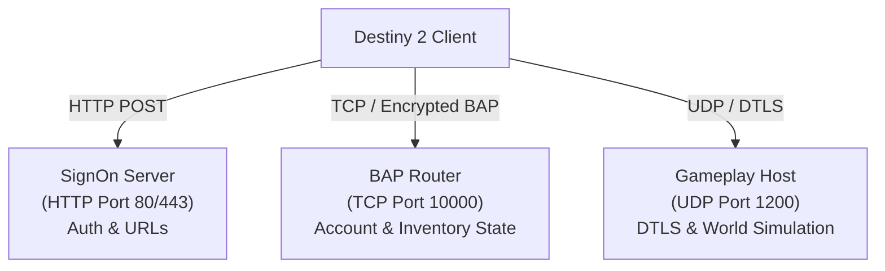

# Network protocols

This document describes the network protocols that Destiny 2 uses and how Sunrise implements them.

## Network architecture overview

Destiny 2 uses three distinct network channels:

1. **SignOn HTTP Service**: Authenticates the client, delivers initial configuration blobs, and returns service URLs.
2. **Binary Application Protocol (BAP)**: A multiplexed TCP protocol. It handles account management, inventory mutations, subscriptions, and notifications.
3. **Gameplay UDP Transport**: A low-latency peer-to-peer and client-server datagram protocol. It replicates game state, physics, and combat events.

---

## 1. SignOn HTTP service

During game boot, the client issues HTTP POST requests to configured SignOn endpoints.

### Authentication flow

1. The client sends a SignOn request containing a platform token.
2. The server verifies the token and creates a session identifier.
3. The server responds with an encoded configuration payload containing:
   - Server monotonic timestamps.
   - Session expiration timestamps.
   - Account entitlement masks.
   - BAP server connection endpoints.
   - Dynamic service URLs for web endpoints.

### Extended configuration blobs

The SignOn response embeds binary configuration blobs:
- **SignOn Config Blob**: Sets engine operational flags, logging options, and telemetry endpoints.
- **Ownership Blob**: Declares entitlement licenses, season passes, and DLC ownership bits.

---

## 2. Binary Application Protocol (BAP)

BAP is a binary message protocol layered on TCP. It operates with both plaintext and encrypted outer frames.

### Frame structure

BAP frames start with a fixed outer header:

| Field | Size | Description |
|---|---|---|
| `frame_type` | 1 byte | Outer frame encoding (0: plaintext, 1: AES-GCM encrypted, 2: bootstrap plaintext) |
| `payload_length` | 3 bytes | Big-endian payload byte count |
| `payload` | Variable | Frame payload (inner header and body) |

### Inner request header

| Field | Size | Description |
|---|---|---|
| `service_id` | 2 bytes | Big-endian request service identifier |
| `task_id` | 4 bytes | Big-endian client task identifier for correlation |
| `body` | Variable | Service-specific payload bytes |

### Cryptographic handshake

1. The client connects and sends a `start` request (Service 30).
2. The server acknowledges with a `start` response (Service 31).
3. The client sends a `serverHello` request (Service 25) with its public key on the NIST P-224 elliptic curve.
4. The server generates an ephemeral ECC P-224 key pair and derives a shared secret.
5. The server responds with `serverHello` (Service 26), returning its public key and an initial AES-GCM nonce.
6. Subsequent traffic uses authenticated AES-GCM frame encryption with SHA-256 HMAC integrity checks.

### Key BAP services

| Request service | Response service | Name | Description |
|---|---|---|---|
| 6 | 7 | `activityHostManager` | Requests an activity session identifier and host details |
| 8 | 9 (Push) | `activityMessage` | Sends activity join requests, keepalives, and state updates |
| 10 | 11 | `webService` | Transports Web Service command envelopes |
| 12 | 13 | `subscribeFamily` | Subscribes to object state update streams |
| 14 | 15 | `unsubscribeFamily` | Releases active state update subscriptions |
| 16 | 17 | `activityHost` | Requests relay endpoints for an activity host |
| 18 | 19 | `clientConfig` | Queries client configuration fields |
| 21 | 22 | `purchasedOffers` | Queries purchased store items |
| 23 | 24 | `accountTranslation` | Resolves membership IDs to account SOIDs |
| 25 | 26 | `serverHello` | Performs cryptographic key agreement |
| 30 | 31 | `start` | Initializes the channel with a nonce echo |
| 32 | 33 | `userMessage` | Queries user message banners |
| 34 | 35 | `skill` | Returns skill records |
| 42 | 43 | `matchmaking` | Submits matchmaking tickets and queries status |
| 44 | 45 | `clan` | Returns clan membership and banner state |
| 110 | 112 | `webServiceServer` | Transports server-role Web Service messages |
| 121 | 122 | `registerSubscriber` | Registers the client for push notifications |
| 250 | 251 | `echo` | Performs connection keepalive checks |
| 302 | 303 | `registerRelayClient` | Registers the client with the packet relay |
| 304 | 305 | `signSteamCertificate`| Validates and wraps Steam networking certificates |
| 306 | 307 | `accountFromMembership` | Resolves account data from membership IDs |

### Push notification services

The server sends unsolicited push frames without a request correlation ID:
- **Service 9 (`activityMessage`)**: Delivers activity membership updates, global state changes, and roster events.
- **Service 123 (`queuezUpdate`)**: Delivers staged object updates across registered state families.

---

## 3. Web Service opcodes (Envelope 10/11)

BAP services 10 and 11 carry bit-packed Web Service messages.

### Envelope structure

- **Header (6 bytes)**:
  - `opcode`: 2 bytes (big-endian).
  - `transaction_id`: 4 bytes (big-endian).
- **Payload**: Bit-packed binary data parsed with `BitReader` and written with `BitWriter`.
- **Trailer**: 2 absent bits marking the end of optional trailer fields.

### Implemented Web Service opcodes

| Opcode | Purpose | Description |
|---|---|---|
| `205` | Get investment state | Returns account-wide unlocks, progression banks, and active flags. |
| `206` | Update investment state | Acknowledges investment state synchronization. |
| `402` | Dismantle item | Dismantles an inventory item and credits materials based on policy. |
| `403` | Transfer item | Moves items between character inventory and vault storage. |
| `406` | Socket action | Applies socket plugs, mods, or masterwork upgrades to gear. |
| `501` | Create character | Allocates a new character slot with chosen class, race, and gender. |
| `503` | Select character | Activates a character slot for the active gameplay session. |
| `504` | Delete character | Removes a character slot and clears its equipped inventory. |
| `505` | Customize character | Updates character cosmetic appearance fields. |
| `601` | Loot pickup | Authorizes ground loot item collection. |
| `801` | Select subclass node | Equips a selected talent node or ability on an equipped subclass. |
| `901` | Vendor purchase | Buys an item from a vendor and charges material requirements. |
| `903` | Vendor interaction | Queries vendor sale rows and purchase requirements. |
| `1820`| Account select | Sets active profile and account selection parameters. |
| `1901`| Launch activity | Starts matchmaking or launches destination transport. |

---

## 4. State families and queues

Sunrise organizes persistent state into numbered families:

- **Family 0 (Bootstrap)**: Provides initial source seeds, platform tickets, and account identity markers.
- **Family 3 (Character list)**: Delivers summary records for available characters.
- **Family 4 (Character details)**: Delivers full character records, equipment loadouts, inventory items, and input bindings.
- **Family 5 (Investment)**: Delivers account progressions, reputation banks, metric flags, and objective unlocks.

---

## 5. Gameplay UDP transport

Gameplay traffic uses UDP datagrams over a dedicated game port (default `1200`).

### Connection lifecycle

1. **NAT Introduction**: The client and server exchange introduction packets to establish UDP reachability.
2. **SRP Key Exchange**: The endpoints execute a 1024-bit Secure Remote Password (SRP) handshake to generate session keys.
3. **DTLS Datagram Protection**: Traffic encrypts with DTLS records. Sequence numbers protect against packet replay attacks.
4. **Peer Association**: Endpoints establish a peer session container that manages packet acknowledgments and retransmission.
5. **Reliable Assembly**: Large payloads split into fragments and reassemble in order at the receiver.

### Gameplay messages

- `ConnectRequest` / `ConnectResponse`: Negotiates peer connection parameters.
- `JoinRequest` / `JoinResponse`: Admits a player into an active activity session.
- `EstablishedPacket`: Confirms bidirectional peer channel establishment.
- `GroupSessionMessage`: Replicates group membership, migration receipts, and parameter registers.
- `ActivityGlobalState`: Synchronizes activity phases, time limits, and objective states.
- `EntityAuthorityUpdate`: Assigns simulation authority for entities between server and clients.
