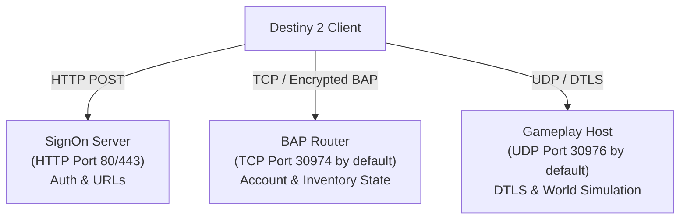

# Network protocols

This document describes the network protocols that Destiny 2 uses and how Sunrise implements them.

## Network architecture overview

Destiny 2 uses three distinct network channels:

1. **SignOn HTTP Service**: Authenticates the client, delivers initial configuration blobs, and returns service URLs.
2. **Binary Application Protocol (BAP)**: A multiplexed TCP protocol. It handles account management, inventory mutations, subscriptions, and notifications.
3. **Gameplay UDP Transport**: A low-latency peer-to-peer and client-server datagram protocol. It replicates game state, physics, and combat events.

---

## 1. SignOn HTTP service

During game boot, the client issues HTTP POST requests to configured SignOn endpoints.

### Authentication flow

1. The client sends a SignOn request containing a platform token.
2. The server verifies the token and creates a session identifier.
3. The server responds with an encoded configuration payload containing:
   - Server monotonic timestamps.
   - Session expiration timestamps.
   - Account entitlement masks.
   - BAP server connection endpoints.
   - Dynamic service URLs for web endpoints.

### Extended configuration blobs

The SignOn response embeds binary configuration blobs:

- **SignOn Config Blob**: Sets engine operational flags, logging options, and telemetry endpoints.
- **Ownership Blob**: Declares entitlement licenses, season passes, and DLC ownership bits.

---

## 2. Binary Application Protocol (BAP)

BAP is a binary message protocol layered on TCP. It operates with both plaintext and encrypted outer frames.

### Frame structure

BAP frames start with a fixed outer header:

| Field            | Size     | Description                                                                       |
| ---------------- | -------- | --------------------------------------------------------------------------------- |
| `magic`          | 1 byte   | Outer-frame marker                                                                |
| `frame_type`     | 1 byte   | Outer frame encoding (0: plaintext, 1: AES-GCM encrypted, 2: bootstrap plaintext) |
| `payload_length` | 4 bytes  | Big-endian payload byte count                                                     |
| `payload`        | Variable | Frame payload (inner header and body)                                             |

### Inner request header

| Field        | Size     | Description                                       |
| ------------ | -------- | ------------------------------------------------- |
| `service_id` | 2 bytes  | Big-endian request service identifier             |
| `task_id`    | 4 bytes  | Big-endian client task identifier for correlation |
| `body`       | Variable | Service-specific payload bytes                    |

### Cryptographic handshake

1. The client connects and sends a `start` request (Service 30).
2. The server acknowledges with a `start` response (Service 31).
3. The client sends a `serverHello` request (Service 25) containing its SignOn token.
4. The server builds the connection key and nonce from SignOn and BAP State.
5. The server returns them in a `serverHello` response (Service 26). This bootstrap
   envelope uses AES-CBC and HMAC-SHA256.
6. Subsequent frame payloads use authenticated AES-GCM encryption. The GCM tag provides
   frame integrity.

### Key BAP services

| Request service | Response service | Name                    | Description                                                 |
| --------------- | ---------------- | ----------------------- | ----------------------------------------------------------- |
| 6               | 7                | `activityHostManager`   | Requests an activity session identifier and host details    |
| 8               | 9 (Push)         | `activityMessage`       | Sends activity join requests, keepalives, and state updates |
| 10              | 11               | `webService`            | Transports Web Service command envelopes                    |
| 12              | 13               | `subscribeFamily`       | Subscribes to object state update streams                   |
| 14              | 15               | `unsubscribeFamily`     | Releases active state update subscriptions                  |
| 16              | 17               | `activityHost`          | Requests relay endpoints for an activity host               |
| 18              | 19               | `clientConfig`          | Queries client configuration fields                         |
| 21              | 22               | `purchasedOffers`       | Queries purchased store items                               |
| 23              | 24               | `accountTranslation`    | Resolves membership IDs to account SOIDs                    |
| 25              | 26               | `serverHello`           | Delivers secure-channel key and nonce material              |
| 30              | 31               | `start`                 | Initializes the channel with a nonce echo                   |
| 32              | 33               | `userMessage`           | Queries user message banners                                |
| 34              | 35               | `skill`                 | Returns skill records                                       |
| 42              | 43               | `matchmaking`           | Submits matchmaking tickets and queries status              |
| 44              | 45               | `clan`                  | Returns clan membership and banner state                    |
| 110             | 112              | `webServiceServer`      | Transports server-role Web Service messages                 |
| 121             | 122              | `registerSubscriber`    | Registers the client for push notifications                 |
| 250             | 251              | `echo`                  | Performs connection keepalive checks                        |
| 302             | 303              | `registerRelayClient`   | Registers the client with the packet relay                  |
| 304             | 305              | `signSteamCertificate`  | Validates and wraps Steam networking certificates           |
| 306             | 307              | `accountFromMembership` | Resolves account data from membership IDs                   |

### Push notification services

The server sends unsolicited push frames without a request correlation ID:

- **Service 9 (`activityMessage`)**: Delivers activity membership updates, global state changes, and roster events.
- **Service 123 (`queuezUpdate`)**: Delivers staged object updates across registered state families.

---

## 3. Web Service opcodes (Envelope 10/11)

BAP services 10 and 11 carry bit-packed Web Service messages.

### Envelope structure

- **Header (6 bytes)**:
  - `opcode`: 2 bytes (big-endian).
  - `transaction_id`: 4 bytes (big-endian).
- **Payload**: Bit-packed binary data parsed with `BitReader` and written with `BitWriter`.
- **Trailer**: 2 absent bits marking the end of optional trailer fields.

### Implemented Web Service opcodes

| Opcode | Purpose                   | Description                                                                                                     |
| ------ | ------------------------- | --------------------------------------------------------------------------------------------------------------- |
| `205`  | Get investment state      | Returns account-wide unlocks, progression banks, and active flags.                                              |
| `206`  | Subscribe to state family | Parses and stages a Queuez family subscription.                                                                 |
| `402`  | Dismantle item            | Dismantles an inventory item and credits materials based on policy.                                             |
| `403`  | Equip item                | Equips an item instance in its semantic equipment slot.                                                         |
| `404`  | Unequip item              | Removes an item instance from its equipment slot.                                                               |
| `406`  | Update item state         | Applies supported item-state actions, such as marking a finisher as a favorite.                                 |
| `501`  | Create-character response | Returns a character SOID already published in family 3; Sunrise does not parse or create from the request body. |
| `503`  | Account bootstrap         | Adopts the primary account SOID and returns investment state.                                                   |
| `504`  | Select character          | Selects the character named by the request SOID.                                                                |
| `505`  | Change character          | Stages the change-character Queuez transition and returns the next family-4 version.                            |
| `601`  | Loot pickup               | Returns the fixed response that completes a loot-pickup request.                                                |
| `801`  | Select subclass node      | Equips a selected talent node or ability on an equipped subclass.                                               |
| `901`  | Vendor purchase           | Parses and explicitly refuses vendor purchases; no item or currency mutation occurs.                            |
| `903`  | Socket action             | Inserts a plug into an ordinary item socket.                                                                    |
| `1820` | Acquire collection item   | Creates a supported item instance from a collection definition.                                                 |
| `1901` | Equipped socket action    | Applies socket replacements to an equipped item, including shader application.                                  |

---

## 4. State families and queues

Sunrise organizes persistent state into numbered families:

- **Family 0 (Bootstrap)**: Provides initial source seeds, platform tickets, and account identity markers.
- **Family 3 (Character list)**: Delivers summary records for available characters.
- **Family 4 (Character details)**: Delivers full character records, equipment loadouts, inventory items, and input bindings.
- **Family 5 (Investment)**: Delivers account progressions, reputation banks, metric flags, and objective unlocks.

---

## 5. Gameplay UDP transport

Gameplay traffic uses UDP datagrams over a dedicated game port (default `30976`).

### Connection lifecycle

1. **NAT Introduction**: The client and server exchange introduction packets to establish UDP reachability.
2. **SRP Key Exchange**: The endpoints execute a 1024-bit Secure Remote Password (SRP) handshake to generate session keys.
3. **DTLS Datagram Protection**: Traffic encrypts with DTLS records. Sequence numbers protect against packet replay attacks.
4. **Peer Association**: Endpoints establish a peer session container that manages packet acknowledgments and retransmission.
5. **Reliable Assembly**: Large payloads split into fragments and reassemble in order at the receiver.

### Gameplay message codecs

The implemented middleware includes connect and join messages, established packets, reliable
assembly, and group member, migration, notice, parameter, session, and view messages. These codecs
provide transport and group-state primitives; they do not imply complete activity or entity
simulation messages.
