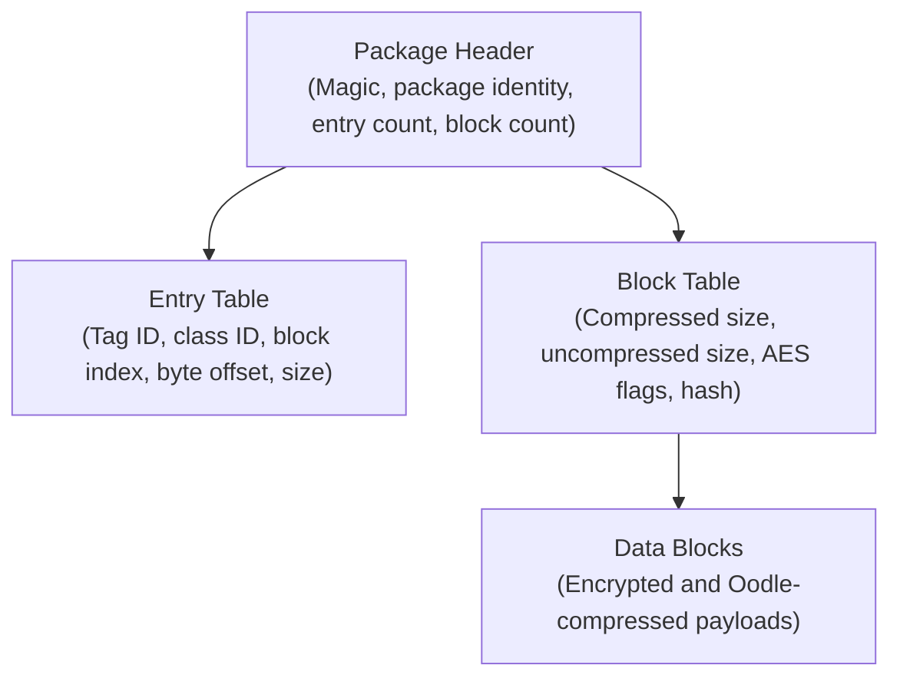
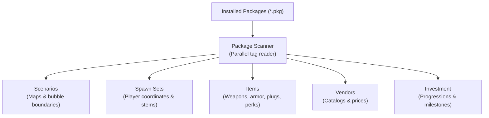

# Package and content system

This document describes the Destiny 2 package archive format (`.pkg`), tag resolution, decompression, and content extraction in Sunrise.

## Package format overview

Destiny 2 stores game assets in `.pkg` files inside the `packages/` directory. Packages contain structured binary data called **tags**. Tags represent items, activities, maps, audio, textures, and entities.

### 1. Package header

The package file begins with a binary header:
- **Magic identifier**: Validates file integrity.
- **Package identifier**: 16-bit integer identifying the package family.
- **Patch identifier**: Suffix index (such as `_0.pkg`, `_1.pkg`). Higher patch numbers override earlier versions.
- **Table offsets**: File offsets pointing to the entry table and block table.
- **Counts**: Number of entries and data blocks in the package.

### 2. Entry table

The entry table contains fixed-width records for each stored tag:
- **Tag handle**: 32-bit handle combining the package ID (upper bits) and entry index (lower 13 bits).
- **Class ID**: 32-bit integer identifying the asset type (for example, scenario, item definition, or texture).
- **Starting block index**: Index into the block table where the tag data begins.
- **Starting offset**: Byte offset within the uncompressed block.
- **Uncompressed length**: Total length of the asset in bytes.

### 3. Block table

Data is divided into discrete blocks (nominally 64 KB per block):
- **Compressed size**: Number of bytes stored on disk.
- **Uncompressed size**: Decompressed size in memory.
- **Encryption flags**: Flags indicating whether the block requires AES decryption.
- **Patch hash**: Verification hash for block data integrity.

---

## Cryptography and decompression

Sunrise extracts content directly from installed packages without external extraction tools.

### AES block decryption

Encrypted blocks use AES in GCM or CBC mode. The reader derives decryption keys from package key material:
- Primary key: 16 bytes.
- Alternate key: 16 bytes.
- Nonce base: 12 bytes.

### Oodle compression

Blocks compress with the Oodle data compression library:
- Sunrise dynamically links with the game engine's Oodle implementation.
- Decompression buffers include slack space (`kBlockSlack = 64` bytes) to prevent memory corruption.

---

## Tag hashing and naming

Game packages refer to assets using integer hashes rather than file paths.

### Hash algorithms

- **Jenkins `lookup3` (hashlittle2)**: Computes 32-bit and 64-bit hashes for virtual asset paths and string references.
- **MurmurHash3**: Indexes definition tables and maps activity names to runtime identifiers.

### Named tags database

Sunrise maintains a built-in catalog of named tags (`named_tags.h`). This catalog maps human-readable strings to tag hashes for:
- Activity destination roots.
- Scenario definitions.
- Item definition tables.
- Vendor catalog roots.

---

## Content extraction pipelines

During startup, Sunrise scans package tables and builds in-memory data structures:

### Extracted content catalogs

1. **Scenarios**:
   - Reads destination maps and geometry handles.
   - Extracts world region definitions and bubble connection boundaries.
2. **Spawn sets**:
   - Scans authored spawn set records.
   - Extracts 3D spawn coordinates (X, Y, Z, yaw, pitch, roll) for destinations.
3. **Item definitions**:
   - Extracts weapons, armor, shaders, mods, and consumable items.
   - Parses socket categories, default plug items, and perk descriptions.
4. **Vendors**:
   - Parses vendor sale tables, purchase conditions, and price requirements.
5. **Investment and progressions**:
   - Extracts reputation tiers, power level caps, and triumph objective definitions.

---

## Cache and memory design

Content extraction processes gigabytes of package data efficiently through multi-level caching:

- **Block cache**: Keeps the last 8 decompressed blocks in memory using Least-Recently-Used (LRU) eviction.
- **Header cache**: Holds 8 parsed package headers to eliminate repeated disk seeks.
- **Scratch buffers**: Dedicated per-thread memory structures (`Scratch`) allow lock-free parallel extraction.
- **Disk manifest cache**: Serializes extracted definition tables to disk. Startup reads the cached manifest after verifying file fingerprints.
