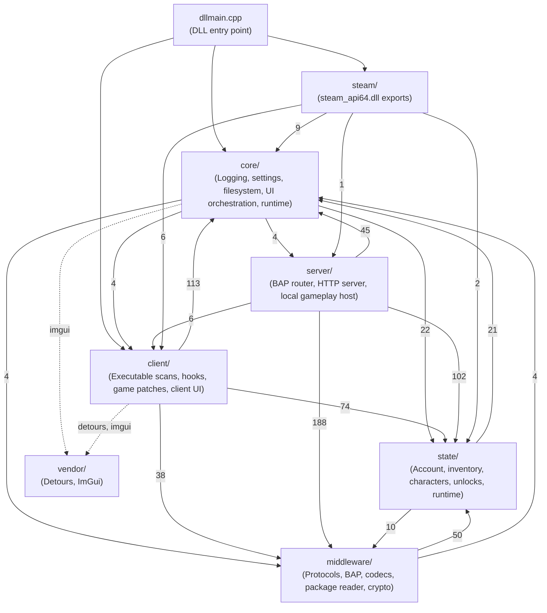

# Project structure and architecture

This document describes the code layout, architectural layers, initialization order, and settings model of Sunrise.

## Architectural layers

Sunrise separates responsibilities into seven directories under `Sunrise/src`. The directories mark
ownership, not a strict acyclic dependency stack. The dependency graph contains cycles, so do not
assume that a lower layer never includes a higher layer.

The graph below shows the include edges between top-level directories. The number on each edge
is the count of resolved `#include` directives that cross the directory boundary.

Read the graph with these rules:

- `core/` reaches upward into `state/`, `middleware/`, `server/`, and `client/`. Two places cause
  this. `core/runtime/core_runtime.cpp` includes every layer runtime because Core drives startup and
  shutdown. `core/settings/` includes the definition and validation headers of the layers whose
  options it parses.
- `core/` does not include `steam/`. The `core/settings/steam/` directory holds the Steam options
  that Core parses, and it belongs to Core.
- `middleware/` and `state/` depend on each other. Middleware codecs write into State record types,
  and State reads package and content structures from Middleware.
- `server/` includes `client/network/consumer.h` and a client content worker, so the server path is
  not free of client code.
- `steam/` is not a leaf. The shim starts and stops Client and Server work from the Steam
  entry points.
- `vendor/` is included through angle-bracket headers, for example `<imgui.h>` and `<detours.h>`,
  not through the paths above.

Because of the cycles, treat "keep code in the narrowest owning layer" as the rule that matters. Do
not treat the directory order as a compile-time guarantee.

### Layer descriptions

- `core/`: Owns settings, logging sinks, filesystem helpers, shared Dear ImGui UI runtime, and the runtime that starts and stops every other layer. Core is not a pure leaf: settings parsing and lifecycle orchestration pull in Client, Server, State, and Middleware headers.
- `middleware/`: Implements low-level protocol codecs, packet serialization, cryptography primitives, package file parsing, Oodle decompression, and bitstream encoding.
- `state/`: Holds persistent in-memory data for accounts, characters, items, equipment, progressions, unlocks, entitlements, and activity configurations. State runs without a database engine.
- `server/`: Implements the local service host. It routes BAP requests, processes HTTP endpoints, manages activity sessions, and simulates the logical gameplay world.
- `client/`: Discovers game code patterns, installs Detours hooks, intercepts network egress, alters engine checks, and displays client UI panels.
- `steam/`: Provides the Steam API compatibility shim. It exports `steam_api64.dll` functions and returns local interface instances.
- `vendor/`: Contains third-party dependencies, including Microsoft Detours and Dear ImGui.

## Lifecycle sequence

The Core runtime coordinates initialization in forward dependency order. When a subsystem fails to start, Core stops previously started subsystems in reverse order.

### Initialization order

1. `settings`: Reads `settings.json` from the artifact directory or loads compiled defaults.
2. `unlocks`: Publishes default unlock flags into State.
3. `logging`: Starts log sinks and background snapshot views.
4. `ui`: Starts the Dear ImGui renderer and input state.
5. `ui_hud`: Registers HUD overlay modules.
6. `ui_logs`: Registers the interactive log viewer module.
7. `entitlements`: Publishes server entitlements.
8. `state`: Starts the in-memory account and activity storage.
9. `content_manifest`: Scans installed package directories and indexes content tables.
10. `middleware`: Starts cryptographic subsystems and secure channel state.
11. `server`: Starts BAP handlers, HTTP routes, and the gameplay transport endpoint.
12. `client`: Resolves pattern signatures and installs Detours hooks in the game process.

### Shutdown order

When the process exits, Sunrise unwinds the initialized stages in reverse dependency order:

1. `client`: Detaches all Detours hooks and restores original code pointers.
2. `server`: Stops gameplay endpoints and closes active BAP connections.
3. `middleware`: Clears encryption contexts and temporary protocol buffers.
4. `content_manifest`: Releases cached package tables and file handles.
5. `state`: Clears in-memory account and activity data.
6. `entitlements`: Clears published entitlements.
7. `ui_logs`: Unregisters the log viewer.
8. `ui_hud`: Unregisters HUD controls and shuts down HUD state.
9. `ui_registry`: Clears the UI module registry.
10. `ui`: Stops the rendering pipeline and font resources.
11. `unlocks`: Clears published unlock policy.
12. `logging`: Flushes sinks and terminates logging threads.
13. `settings`: Releases active configuration memory.

## Threading and synchronization

Sunrise operates in a multithreaded game process. Subsystems apply these concurrency rules:

- Core runtime locks: `SRWLOCK` protects layer state transitions during initialization and shutdown.
- State locking: Reader-writer locks guard account snapshots and inventory transactions.
- Zero allocation fast paths: Network packet encoders and hook detours use caller-owned buffers. They do not allocate dynamic memory on hot paths.
- Hook safety: Detours transactions suspend worker threads during hook attachment. Hook uninstallation verifies that no thread executes inside replacement code.

## Settings system

Settings live in `settings.json` inside the Sunrise artifact directory, which is next to
`steam_api64.dll`. `core::path::artifact_directory()` takes the directory of the loaded module,
appends the `Sunrise` subdirectory, and creates it if it is missing. Every generated file goes below
that subdirectory.

For a DLL at `D:\Destiny2\bin\x64\steam_api64.dll`, the paths are:

| File               | Path                                                     | Written by                                                  |
| ------------------ | -------------------------------------------------------- | ----------------------------------------------------------- |
| Settings           | `D:\Destiny2\bin\x64\Sunrise\settings.json`              | `core/settings/settings_runtime.cpp`                        |
| Current log        | `D:\Destiny2\bin\x64\Sunrise\logs\sunrise.log`           | `core/logging/log.cpp`                                      |
| Previous log       | `D:\Destiny2\bin\x64\Sunrise\logs\sunrise.log.old`       | `core/logging/log.cpp`                                      |
| HUD layout         | `D:\Destiny2\bin\x64\Sunrise\hud.json`                   | `core/ui/hud/store/hud_settings_store.cpp`                  |
| Player options     | `D:\Destiny2\bin\x64\Sunrise\player.json`                | `client/player/player_settings_store.cpp`                   |
| Movement options   | `D:\Destiny2\bin\x64\Sunrise\movement.json`              | `client/movement/movement_settings_store.cpp`               |
| Inactivity options | `D:\Destiny2\bin\x64\Sunrise\inactivity.json`            | `client/inactivity/inactivity_settings_store.cpp`           |
| Build data cache   | `D:\Destiny2\bin\x64\Sunrise\cache\build_data.bin`       | `state/build_data/build_data_runtime.cpp`                   |
| Manifest cache     | `D:\Destiny2\bin\x64\Sunrise\cache\content_manifest.bin` | `state/content_manifest/content_manifest_state_runtime.cpp` |

- Schema version: Current layout version is 8. See `kSettingsVersion` in
  [`Sunrise/src/core/settings/settings.h`](../Sunrise/src/core/settings/settings.h) and the
  `"version"` key in
  [`Sunrise/resources/default_settings.json`](../Sunrise/resources/default_settings.json).
- Migration: Missing fields populate with default values. Unsupported structure versions trigger upgrade routines.
- Top-level configuration keys:
  - `version`: Settings schema version.
  - `core`: Logging sinks and per-channel log levels.
  - `client`: UI preferences, movement cheat keys, and camera controls.
  - `server`: BAP and gameplay endpoint settings, activation gates, and entitlements.
  - `steam`: Emulated Steam ID and player persona name.
  - `state`: Initial account, characters, unlocks, investment overrides, and activity defaults.
