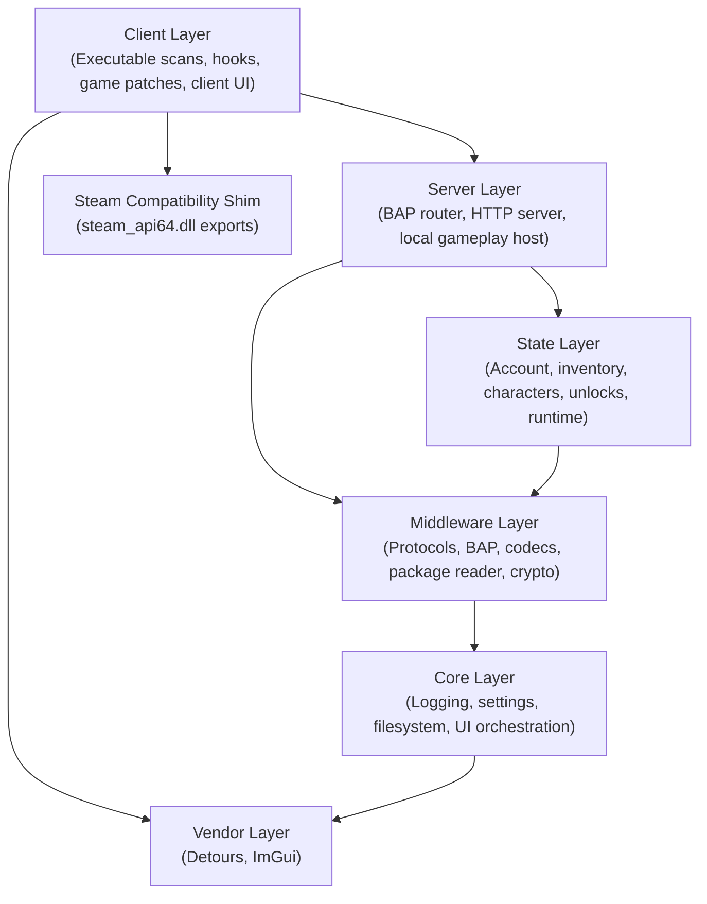

# Project structure and architecture

This document describes the code layout, architectural layers, initialization order, and settings model of Sunrise.

## Architectural layers

Sunrise separates responsibilities into seven distinct layers. Each layer has strict dependency boundaries. Higher layers depend on lower layers. Lower layers do not depend on higher layers.

### Layer descriptions

- `core/`: Owns settings, logging sinks, filesystem helpers, and shared Dear ImGui UI runtime. Core does not depend on any game logic or network protocols.
- `middleware/`: Implements low-level protocol codecs, packet serialization, cryptography primitives, package file parsing, Oodle decompression, and bitstream encoding.
- `state/`: Holds persistent in-memory data for accounts, characters, items, equipment, progressions, unlocks, entitlements, and activity configurations. State runs without a database engine.
- `server/`: Implements the local service host. It routes BAP requests, processes HTTP endpoints, manages activity sessions, and simulates the logical gameplay world.
- `client/`: Discovers game code patterns, installs Detours hooks, intercepts network egress, alters engine checks, and displays client UI panels.
- `steam/`: Provides the Steam API compatibility shim. It exports `steam_api64.dll` functions and returns local interface instances.
- `vendor/`: Contains third-party dependencies, including Microsoft Detours and Dear ImGui.

## Lifecycle sequence

The Core runtime coordinates initialization in forward dependency order. When a subsystem fails to start, Core stops previously started subsystems in reverse order.

### Initialization order

1. `settings`: Reads `settings.json` from disk or loads compiled defaults.
2. `unlocks`: Publishes default unlock flags into State.
3. `logging`: Starts log sinks and background snapshot views.
4. `ui`: Starts the Dear ImGui renderer and input state.
5. `ui_hud`: Registers HUD overlay modules.
6. `ui_logs`: Registers the interactive log viewer module.
7. `entitlements`: Publishes server entitlements.
8. `state`: Starts the in-memory account and activity storage.
9. `content_manifest`: Scans installed package directories and indexes content tables.
10. `middleware`: Starts cryptographic subsystems and secure channel state.
11. `server`: Starts BAP handlers, HTTP routes, and the gameplay transport endpoint.
12. `client`: Resolves pattern signatures and installs Detours hooks in the game process.

### Shutdown order

When the process exits, Sunrise unwinds the initialized stages in reverse dependency order:

1. `client`: Detaches all Detours hooks and restores original code pointers.
2. `server`: Stops gameplay endpoints and closes active BAP connections.
3. `middleware`: Clears encryption contexts and temporary protocol buffers.
4. `content_manifest`: Releases cached package tables and file handles.
5. `state`: Clears in-memory account and activity data.
6. `entitlements`: Clears published entitlements.
7. `ui_logs`: Unregisters the log viewer.
8. `ui_hud`: Unregisters HUD controls and shuts down HUD state.
9. `ui_registry`: Clears the UI module registry.
10. `ui`: Stops the rendering pipeline and font resources.
11. `unlocks`: Clears published unlock policy.
12. `logging`: Flushes sinks and terminates logging threads.
13. `settings`: Releases active configuration memory.

## Threading and synchronization

Sunrise operates in a multithreaded game process. Subsystems apply these concurrency rules:

- Core runtime locks: `SRWLOCK` protects layer state transitions during initialization and shutdown.
- State locking: Reader-writer locks guard account snapshots and inventory transactions.
- Zero allocation fast paths: Network packet encoders and hook detours use caller-owned buffers. They do not allocate dynamic memory on hot paths.
- Hook safety: Detours transactions suspend worker threads during hook attachment. Hook uninstallation verifies that no thread executes inside replacement code.

## Settings system

Settings live in `settings.json` next to `steam_api64.dll`.

- Schema version: Current layout version is 8 (`kSettingsVersion = 8`).
- Migration: Missing fields populate with default values. Unsupported structure versions trigger upgrade routines.
- Top-level configuration keys:
  - `version`: Settings schema version.
  - `core`: Logging sinks and per-channel log levels.
  - `client`: UI preferences, movement cheat keys, and camera controls.
  - `server`: BAP and gameplay endpoint settings, activation gates, and entitlements.
  - `steam`: Emulated Steam ID and player persona name.
  - `state`: Initial account, characters, unlocks, investment overrides, and activity defaults.
