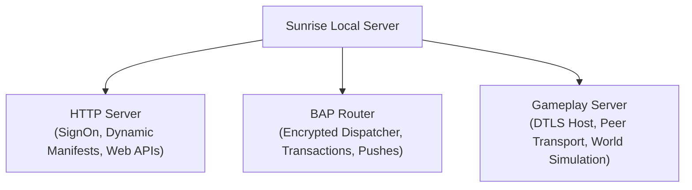
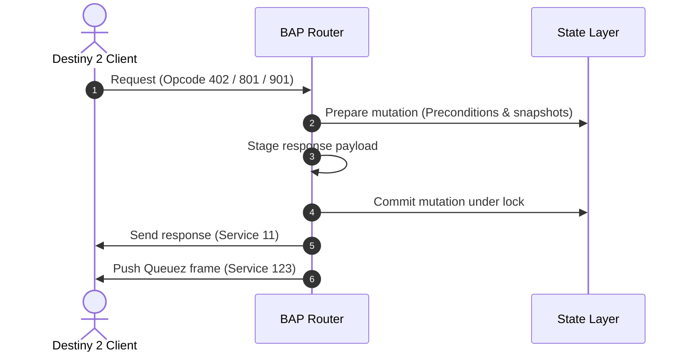
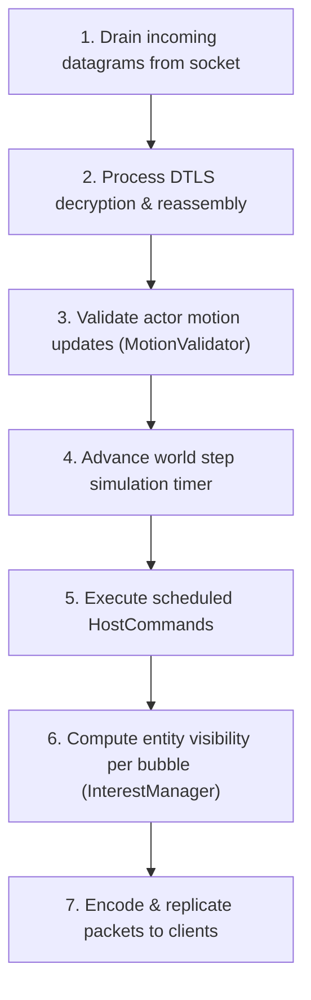

# Server architecture

This document describes the design and subsystems of the Sunrise local server.

## Server subsystems overview

The Sunrise server runs inside the game process and coordinates three major subsystems:

---

## 1. HTTP server

The embedded HTTP server intercepts and handles REST and SignOn traffic.

- **Request dispatcher**: Matches incoming HTTP URLs and method verbs.
- **SignOn handler**: Authenticates client sessions and encodes binary configuration payloads.
- **Content delivery routes**: Supplies dynamic manifest endpoints and fallback web responses.

---

## 2. BAP router and transaction pipeline

The BAP router handles state synchronization, client commands, and push notifications over TCP.

### Request routing

1. Incoming frames decrypt through the authenticated AES-GCM layer.
2. The router extracts the service ID and passes the payload to the registered service handler.
3. Handlers generate binary response payloads.
4. The router encrypts the response and transmits it to the client socket.

### Transaction staging and commits

State mutations (such as dismantling items or changing subclass nodes) execute through a two-phase commit pipeline:

### Push notification staging

The server maintains push notification queues for connected clients:
- **Activity arrivals**: Notifies the client when session members enter an activity.
- **Membership updates**: Synchronizes character rosters and fireteam slots.
- **Queuez updates**: Broadcasts modified state family objects.
- **Snapshot storage**: Retains latest state revisions for reconnecting clients.

---

## 3. Gameplay server and world simulation

The gameplay server simulates the interactive world, synchronizes peers, and processes player physics.

### Network transport layers

- **Association host**: Executes SRP authentication and issues session encryption keys.
- **DTLS host**: Encrypts and decrypts real-time UDP datagrams.
- **Peer transport**: Tracks sequence numbers, acknowledges received packets, and retransmits lost fragments.
- **Group host**: Coordinates fireteam membership, session parameters, and migration notices.

### Physics and world simulation

The world host executes a fixed-step simulation loop:

### World simulation components

- **`BubbleHost`**: Manages geographical world partitions (bubbles) and handles loading transitions between areas.
- **`HostWorld`**: Holds active actors, entity transforms, velocity vectors, and simulation clocks.
- **`ActorControllerService`**: Updates actor positions, health values, and state flags.
- **`MotionValidator`**: Enforces velocity thresholds and prevents illegal client position leaps.
- **`InterestManager`**: Filters entity replication so clients receive updates only for entities in their active bubble.
- **`HostCommand` and `HostJournal`**: Logs world state transitions and provides rollback checkpoints.
- **`FallbackPolicy`**: Provides safe default world behavior when no mission script is active.
