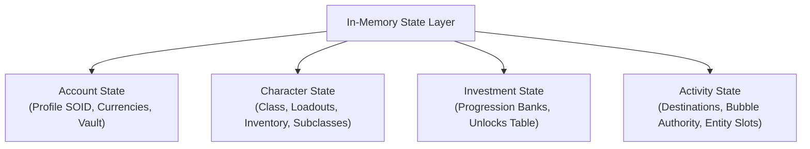

# State management

This document describes the in-memory state architecture, account structures, character models, and inventory management in Sunrise.

## State model overview

Sunrise maintains all game state in memory. It operates without an external database engine.

---

## 1. Account state

The account state represents the player profile across all characters.

- **Primary SOID**: 64-bit Structured Object Identifier uniquely identifying the account.
- **Profile inventory**: Account-wide items, currencies (Glimmer, Legendary Shards, Bright Dust), and vault storage.
- **Dismantle policies**: Configurable reward tables defining materials awarded when dismantling gear.
- **Account preferences**: User key bindings, controller sensitivity, graphics options, and audio levels.

---

## 2. Character state

Sunrise supports up to three playable character slots per account (`kCharacterCapacity = 3`).

### Character attributes

- **Race**: Human (`0`), Awoken (`1`), Exo (`2`).
- **Gender**: Male (`0`), Female (`1`).
- **Class**: Titan (`0`), Hunter (`1`), Warlock (`2`).
- **Power level**: Dynamically calculated from equipped weapon and armor power values.
- **Last destination**: Hash of the destination where the character was last located.

### Equipment and loadouts

Each character maintains dedicated equipment slots:
- **Weapons**: Kinetic, Energy, Power.
- **Armor**: Helmet, Gauntlets, Chest Armor, Leg Armor, Class Item.
- **Cosmetics**: Ghost Shell, Vehicle (Sparrow), Ship, Emblem, Emote.

### Unequipped inventory

Characters hold unequipped inventory items organized in discrete bucket ranges.

---

## 3. Subclasses and ability selection

Characters equip a subclass item (such as Striker, Gunslinger, or Voidwalker).

### Subclass provisioning

When an account loads, Sunrise verifies that each character possesses all three elemental subclasses (Solar, Arc, Void) for their class. Missing subclasses are added automatically to unequipped inventory.

### Ability nodes and selection

Subclass talents organize into semantic ability categories:
- Movement ability (Jumps, glides, lifts).
- Super ability.
- Melee ability.
- Grenade ability.
- Class ability (Barricade, Dodge, Rift).
- Attunement perk paths.

Sunrise tracks selected ability nodes using a 64-bit bitmask (`acquiredSubclassAbilityMask`). Clicking talent nodes in the UI triggers Web Service opcode `801` to mutate active selections.

---

## 4. Progression, unlocks, and investment

The investment subsystem tracks progression metrics:

- **Progression banks**: Keyed records tracking faction reputation, seasonal rank, experience points, and milestone progression.
- **Unlocks table (`state::unlocks::Table`)**: Bitmasks and counters tracking completed triumphs, story objectives, vendor access, and destination unlocks.
- **Family 5 state**: Generates binary investment snapshots (opcode `205`) for client synchronization.

---

## 5. Activity and matchmaking state

Sunrise manages runtime activity selections and destination routing:

- **Destination overrides**: Allows forcing a specific destination hash on activity launch.
- **Bubble authority**: Assigns authority tokens for destination zones and transition bubbles.
- **Entity slots**: Allocates active entity slot indices for players joining the destination.
- **Matchmaking transactions**: Tracks ticket states from matchmaking requests to destination launch.
