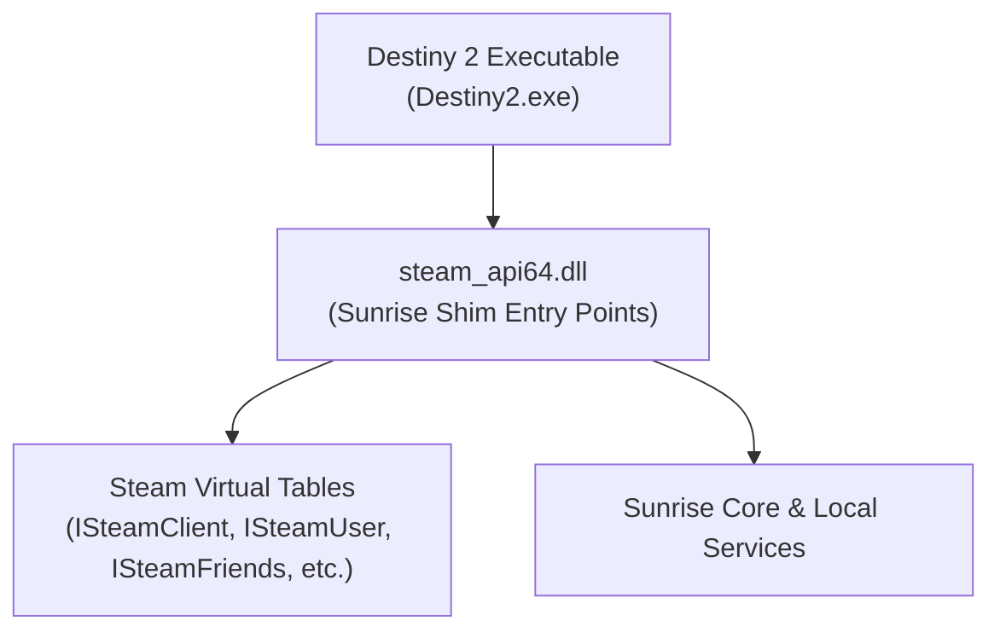

# Steam compatibility shim

This document describes the process-local Steam API emulation provided by Sunrise in `steam_api64.dll`.

## Steam shim overview

Destiny 2 links dynamically with `steam_api64.dll` to access Steam platform features (such as user authentication, friends lists, and peer networking).

Sunrise replaces the official `steam_api64.dll` with a custom implementation. This replacement satisfies the game's initialization requirements without running the Steam client desktop application.

---

## 1. Exported entry points

Sunrise exports standard Steam API functions from `Sunrise/src/dllmain.cpp`:

| Exported function | Purpose | Shim behavior |
|---|---|---|
| `SteamAPI_Init` | Initializes the Steam client API | Starts Sunrise Steam runtime and Core subsystems |
| `SteamAPI_Shutdown` | Shuts down Steam client API | Stops Sunrise runtime cleanly |
| `SteamAPI_RunCallbacks` | Dispatches pending API callbacks | Executes registered callback objects on calling thread |
| `SteamAPI_RestartAppIfNecessary` | Checks if game was started via Steam | Returns `false` to prevent process restarts |
| `SteamAPI_IsSteamRunning` | Checks if Steam client is active | Returns `true` |
| `SteamAPI_GetHSteamUser` | Gets current Steam user handle | Returns local constant user handle |
| `SteamAPI_GetHSteamPipe` | Gets current Steam IPC pipe handle | Returns local constant pipe handle |
| `SteamAPI_RegisterCallback` | Registers a callback listener | Adds listener to local callback registry |
| `SteamAPI_UnregisterCallback` | Removes a callback listener | Removes listener from registry |
| `SteamAPI_RegisterCallResult` | Registers an async call result listener | Associates listener with pending API call ID |
| `SteamAPI_UnregisterCallResult`| Removes an async call result listener | Disassociates listener |
| `SteamInternal_ContextInit` | Initializes Steam context table | Populates context struct with interface pointers |
| `SteamInternal_CreateInterface` | Instantiates interface by name | Returns pointer to matching virtual method table |
| `SteamInternal_FindOrCreateUserInterface` | Finds or creates user interface | Returns pointer to user-scoped interface |

### Sunrise bootstrap exports

Sunrise also exports functions for standalone loaders or test runners:
- `SunriseInitialize()`: Initializes egress sandbox and Core runtime.
- `SunriseActivateClient()`: Activates in-process game hooks.
- `SunriseShutdown()`: Stops all subsystems.

---

## 2. Emulated Steam interfaces

Sunrise implements virtual method tables for common Steam interfaces:

- **`ISteamClient`**: Provides factory methods for accessing other subsystem interfaces.
- **`ISteamUser`**: Returns configured Steam IDs, handles auth session tickets, and reports logged-in status.
- **`ISteamFriends`**: Supplies player persona name and returns empty friend rosters.
- **`ISteamUtils`**: Reports app ID, UI language, server time, and battery power status.
- **`ISteamNetworkingSockets`**: Provides local socket emulation and dummy connection handles.
- **`ISteamNetworkingUtils`**: Supplies certificate verification status and ping measurements.
- **`ISteamMatchmaking`**: Emulates lobby and server search queries.
- **`ISteamUserStats`**: Reports achievement status and leaderboard queries.
- **`ISteamApps`**: Validates DLC installation and ownership flags.
- **`ISteamInventory`**: Returns local inventory result sets.
- **`ISteamUGC`**: Emulates user-generated content queries.

---

## 3. Callback queue and dispatch

Steam API uses asynchronous callbacks and call results.

- **Callback registry**: Tracks registered callback listeners by message ID.
- **Call results**: Tracks asynchronous requests with unique 64-bit API call identifiers.
- **`SteamAPI_RunCallbacks()`**: Processes queued events on the main thread and invokes registered handlers.
