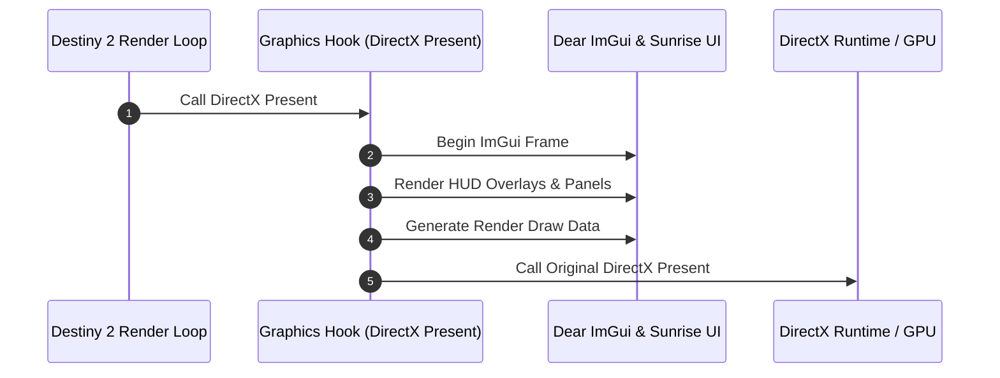

# User interface and diagnostics

This document describes the in-game Dear ImGui interface, HUD overlays, diagnostic logging tools, and input integration in Sunrise.

## UI architecture overview

Sunrise embeds a customized Dear ImGui runtime directly inside the Destiny 2 process. The overlay renders on top of the game screen without external window managers.

---

## 1. Dear ImGui theme and presentation

Sunrise uses an in-house theme and styling system:

- **Theme engine**: Dark palette with gold and blue accents, customized padding, and rounded borders.
- **DPI scaling**: Scales font sizes and UI geometry according to display DPI.
- **Font management**: Loads bundled TrueType fonts and system fonts at runtime.
- **Animation system**: Provides smooth easing transitions for opening menus, fading notices, and tab switching.

---

## 2. HUD overlays

Sunrise displays in-game HUD widgets:

- **Session overlay**: Displays active destination name, bubble hash, connection state, and server tick rate.
- **Status overlay**: Displays player 3D coordinates (X, Y, Z), camera angles (yaw, pitch, roll), and current movement velocity.
- **Logo overlay**: Displays Sunrise version and branding badge.

---

## 3. Interactive UI modules

Sunrise organizes UI panels using a modular registry (`ui_module_registry.h`):

### Core modules

- **HUD controls (`ui/modules/hud/`)**:
  - Registers the `core.hud` page for overlay visibility controls.
- **Logs viewer (`ui/modules/logs/`)**:
  - Displays real-time log messages from the Core ring buffer.
  - Filters messages by channel (`core`, `client`, `state`, `server`, `middleware`).
  - Filters messages by log level (`debug`, `info`, `warn`, `error`).
  - Supports live string search and pause/resume toggles.

### Client modules

- **Movement panel (`client/ui/movement/`)**:
  - Toggles fly mode, noclip, and sword skating enhancements.
  - Configures movement speed multipliers.
  - Saves and loads 3D teleport bookmarks.
- **Player panel (`client/ui/player/`)**:
  - Toggles infinite ammo and removes reload delays.
  - Disables inactivity AFK kick timers.

### Server modules

- **Activity override panel (`server/ui/activity_override/`)**:
  - Forces destination hashes and spawn set overrides when launching destinations from the director.

---

## 4. Input handling and cursor management

When the user opens the Sunrise menu (default key: `Insert`):

- **Window message hook**: Intercepts `WM_KEYDOWN`, `WM_KEYUP`, `WM_MOUSEMOVE`, and mouse clicks to feed Dear ImGui.
- **Input routing**: Suppresses game keyboard and mouse inputs so the game does not react while interacting with UI menus.
- **Cursor guard**: Releases Windows mouse clipping and restores cursor visibility while the menu is active.

---

## 5. Wine and Proton compatibility

Sunrise supports running on Linux via Wine and Valve's Proton:

- **`wine_compat.h`**: Detects Wine runtime environments.
- **DirectX translation**: Adjusts swap chain presentation and viewport synchronization when DXVK or VKD3D-Proton is active.
